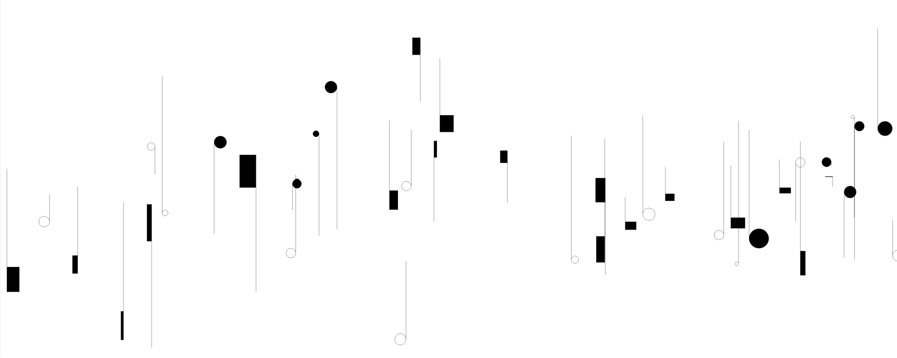

# Abstract Art Generator

This Python script generates a set of random lines and shapes on a canvas using the Python Imaging Library (PIL), random number generation, and probability distributions provided by the PyTorch library.

## Features

- Generates a set of random lines and shapes on a canvas, inspired by Roman Haubenstock-Ramati
- Supports the generation of rectangles and circles.
- Allows customization of line lengths, rectangle dimensions, circle radii, and other parameters.

## Requirements

- Python 3.x
- PIL (Python Imaging Library)
- PyTorch

## Installation

1. Clone the repository:

    ```
    git clone https://github.com/ClozeLine/abstract-art-gen.git
    ```

2. Install the required dependencies:

    ```
    pip install pillow torch
    ```

## Usage

1. Run the script `abstract-art-gen.py`:

    ```
    python abstract-art-gen.py
    ```

2. Adjust the parameters within the script to customize the generation of lines and shapes.

## Parameters

- `canvas_height`: Height of the canvas in pixels.
- `canvas_width`: Width of the canvas in pixels.
- `num_lines`: Number of lines to generate (with shapes attached to extrimities)
- Various parameters for customizing line lengths, rectangle dimensions, circle radii, and more.

## Preview


Example of generated image

## Contributing

Contributions are welcome! Feel free to fork the repository and submit pull requests.

## License

This project is licensed under the Creative Commons License - see the [LICENSE](LICENSE) file for details.
